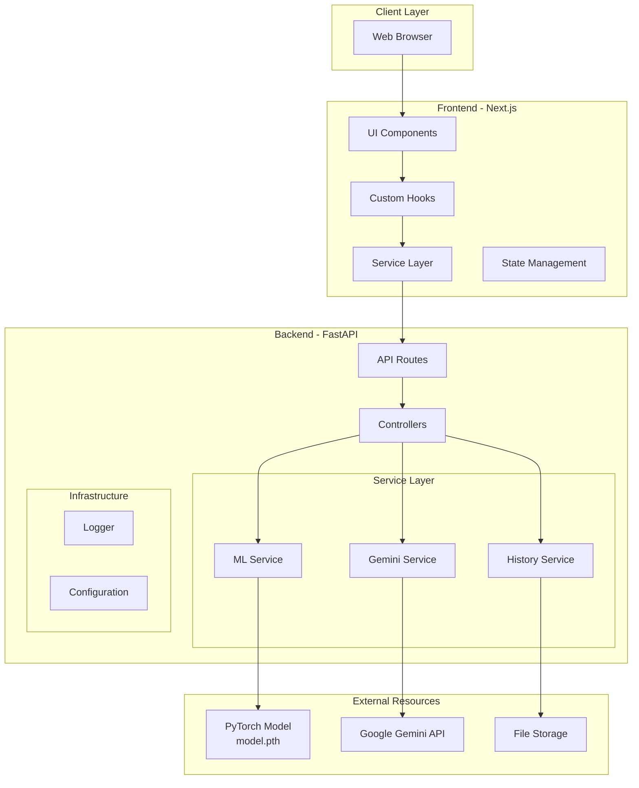
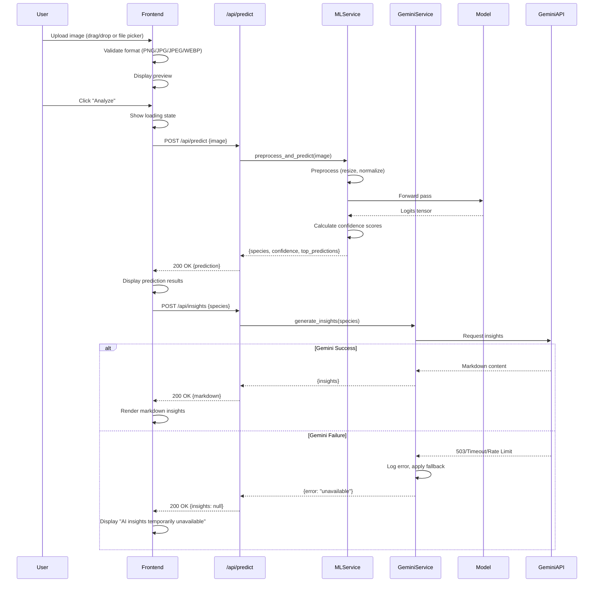
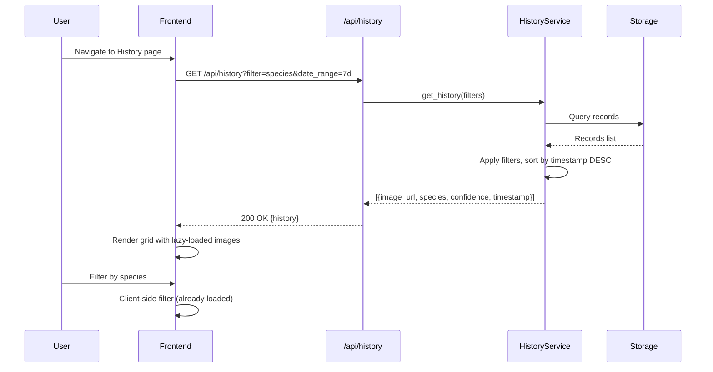
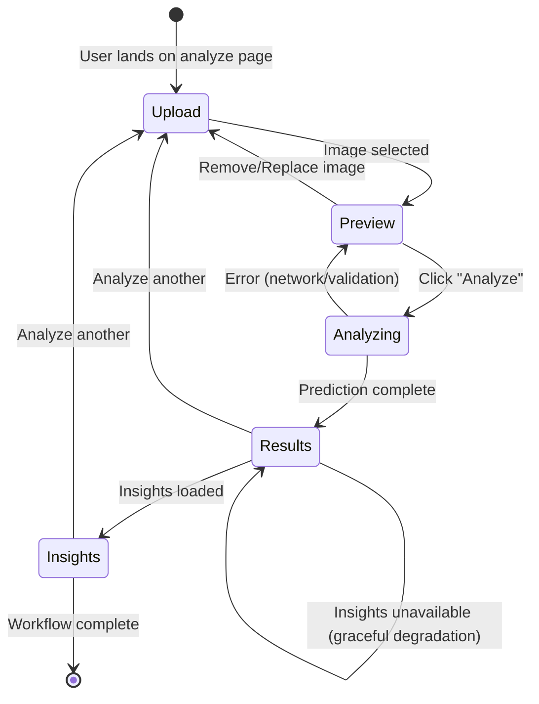
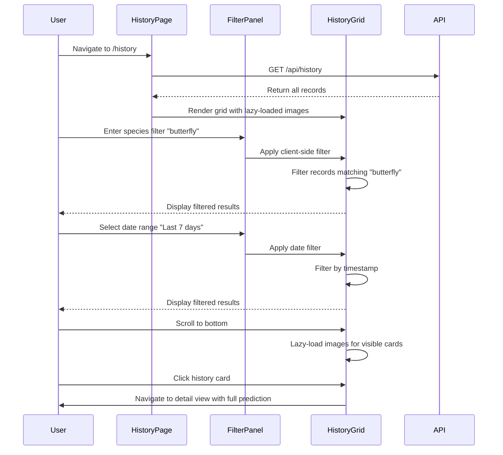

# Design Document: Smart Insect Identifier Platform

## Overview

The Smart Insect Identifier platform is a production-grade AI-powered web application that enables users to identify insect species through image upload. The system combines a pre-trained PyTorch classification model with Google Gemini API to deliver both accurate species identification and educational insights. The platform is architected for graceful degradation, ensuring core functionality remains available even when external services fail.

### Key Design Principles

1. **Service Isolation**: Clear separation between ML inference, external API integration, and data persistence
2. **Graceful Degradation**: Core prediction functionality never depends on optional services (Gemini API)
3. **Performance Optimization**: Model loaded once at startup; singleton pattern for shared resources
4. **Premium User Experience**: Modern, accessible interface comparable to Google Lens and Linear
5. **Production Readiness**: Structured logging, health monitoring, comprehensive error handling

### System Boundaries

**In Scope:**
- FastAPI backend with REST API endpoints
- Next.js frontend with modern UI components
- PyTorch model inference pipeline
- Google Gemini API integration for educational insights
- Prediction history storage and retrieval
- Health monitoring and system diagnostics

**Out of Scope:**
- Model training or retraining
- User authentication and authorization
- Multi-user account management
- Mobile native applications
- Real-time collaborative features

## Architecture

### High-Level System Architecture

The system follows a clean architecture pattern with clear boundaries between layers:



### Layer Responsibilities

**Frontend Layer (Next.js)**
- User interface rendering and interaction
- Client-side validation
- State management for upload workflow
- API communication through service layer
- Responsive layout and accessibility

**Backend Layer (FastAPI)**
- RESTful API endpoints
- Request validation and response formatting
- Service orchestration
- Error handling and logging
- CORS configuration

**Service Layer**
- `ML_Service`: Model loading, image preprocessing, inference
- `Gemini_Service`: External API integration, retry logic, fallback handling
- `History_Service`: Data persistence, retrieval, filtering

**Infrastructure Layer**
- Configuration management
- Structured logging
- Health monitoring
- Environment variable handling

### Data Flow Diagrams

#### Upload and Prediction Flow



#### History Retrieval Flow



## Components and Interfaces

### Backend Components

#### 1. ML Service (`services/ml_service.py`)

**Responsibilities:**
- Load PyTorch model once at application startup
- Maintain model as singleton instance in memory
- Preprocess uploaded images to match training conditions
- Execute inference and return predictions
- Calculate confidence scores and top-k predictions

**Interface:**

```python
class MLService:
    """Singleton service for ML inference."""
    
    _instance = None
    _model = None
    _labels = None
    _metadata = None
    
    def __init__(self):
        """Private constructor - use get_instance() instead."""
        if MLService._instance is not None:
            raise RuntimeError("Use MLService.get_instance()")
    
    @classmethod
    def get_instance(cls) -> 'MLService':
        """Get singleton instance of ML service."""
        if cls._instance is None:
            cls._instance = cls.__new__(cls)
            cls._instance._load_model()
        return cls._instance
    
    def _load_model(self) -> None:
        """Load model, labels, and metadata from artifacts directory."""
        # Load model.pth, labels.json, metadata.json
        # Set model to eval mode
        # Move to appropriate device (CPU/GPU)
    
    def preprocess_image(self, image_bytes: bytes) -> torch.Tensor:
        """
        Preprocess image to match model input requirements.
        
        Args:
            image_bytes: Raw image bytes from upload
            
        Returns:
            Preprocessed tensor ready for inference
            
        Raises:
            ValueError: If image format is invalid
        """
    
    def predict(self, image_tensor: torch.Tensor, top_k: int = 5) -> PredictionResult:
        """
        Run inference and return predictions.
        
        Args:
            image_tensor: Preprocessed image tensor
            top_k: Number of top predictions to return
            
        Returns:
            PredictionResult with species, confidence, and alternatives
        """
    
    def is_loaded(self) -> bool:
        """Check if model is loaded in memory."""
        return self._model is not None
```

**Key Design Decisions:**

1. **Singleton Pattern**: Ensures model loads only once, conserving memory and improving performance
2. **Separation of Concerns**: Preprocessing and inference are separate methods for testability
3. **Error Handling**: Raises specific exceptions for invalid inputs that can be caught by routes
4. **Device Agnostic**: Automatically detects and uses GPU if available, falls back to CPU

**Model Loading Strategy:**

```python
def _load_model(self):
    model_path = Path("backend/artifacts/model.pth")
    labels_path = Path("backend/artifacts/labels.json")
    metadata_path = Path("backend/artifacts/metadata.json")
    
    if not model_path.exists():
        raise FileNotFoundError(f"Model not found at {model_path}")
    
    # Load model weights
    self._model = torch.load(model_path, map_location=torch.device('cpu'))
    self._model.eval()  # Set to evaluation mode
    
    # Load class labels
    with open(labels_path) as f:
        self._labels = json.load(f)
    
    # Load metadata (input size, normalization params)
    with open(metadata_path) as f:
        self._metadata = json.load(f)
    
    logger.info(f"Model loaded: {len(self._labels)} classes")
```

**Image Preprocessing Pipeline:**

```python
def preprocess_image(self, image_bytes: bytes) -> torch.Tensor:
    # 1. Decode image bytes to PIL Image
    image = Image.open(io.BytesIO(image_bytes)).convert('RGB')
    
    # 2. Resize to model input dimensions
    input_size = self._metadata['input_size']  # e.g., 224
    transform = transforms.Compose([
        transforms.Resize((input_size, input_size)),
        transforms.ToTensor(),
        transforms.Normalize(
            mean=self._metadata['normalization']['mean'],
            std=self._metadata['normalization']['std']
        )
    ])
    
    # 3. Apply transformations
    tensor = transform(image)
    
    # 4. Add batch dimension
    tensor = tensor.unsqueeze(0)
    
    return tensor
```

#### 2. Gemini Service (`services/gemini_service.py`)

**Responsibilities:**
- Communicate with Google Gemini API
- Format prompts for educational insights
- Implement retry logic with exponential backoff
- Handle timeouts and rate limiting
- Provide fallback behavior for failures

**Interface:**

```python
class GeminiService:
    """Service for Google Gemini API integration."""
    
    def __init__(self, api_key: str, timeout: int = 10):
        """
        Initialize Gemini service.
        
        Args:
            api_key: Google Gemini API key
            timeout: Request timeout in seconds (default: 10)
        """
        self.api_key = api_key
        self.timeout = timeout
        self.max_retries = 3
        self.base_delay = 1  # seconds
    
    async def generate_insights(self, species_name: str) -> Optional[str]:
        """
        Generate educational insights for identified species.
        
        Args:
            species_name: Common or scientific name of species
            
        Returns:
            Markdown-formatted insights or None if unavailable
            
        Raises:
            GeminiServiceError: For permanent failures requiring intervention
        """
    
    def _build_prompt(self, species_name: str) -> str:
        """Build structured prompt for Gemini API."""
    
    async def _request_with_retry(self, prompt: str) -> Optional[str]:
        """Execute request with exponential backoff retry logic."""
    
    def _is_transient_error(self, status_code: int) -> bool:
        """Determine if error is transient and retry-able."""
```

**Prompt Engineering:**

```python
def _build_prompt(self, species_name: str) -> str:
    return f"""Provide detailed educational information about {species_name}.

Include the following sections:

## Taxonomy
Provide the complete taxonomic classification (Kingdom, Phylum, Class, Order, Family, Genus, Species).

## Physical Characteristics
Describe distinguishing features, size, color patterns, and body structure.

## Habitat and Distribution
Explain where this species is commonly found and its geographic range.

## Behavior and Ecology
Describe feeding habits, life cycle, and ecological role.

## Identification Tips
Provide practical tips for identifying this species in the field.

## Conservation Status
Mention conservation status and any threats to the species.

Format the response in clear, well-structured markdown."""
```

**Retry Logic with Exponential Backoff:**

```python
async def _request_with_retry(self, prompt: str) -> Optional[str]:
    for attempt in range(self.max_retries):
        try:
            response = await self._make_request(prompt)
            return response
        except Exception as e:
            if not self._is_transient_error(e.status_code):
                logger.error(f"Permanent Gemini error: {e}")
                return None
            
            if attempt < self.max_retries - 1:
                delay = self.base_delay * (2 ** attempt)  # Exponential backoff
                logger.warning(f"Gemini retry {attempt + 1}/{self.max_retries} after {delay}s")
                await asyncio.sleep(delay)
            else:
                logger.error(f"Gemini failed after {self.max_retries} attempts")
                return None
    
    return None

def _is_transient_error(self, status_code: int) -> bool:
    """Transient errors that warrant retry."""
    return status_code in [429, 500, 502, 503, 504]
```

**Timeout Handling:**

```python
async def generate_insights(self, species_name: str) -> Optional[str]:
    try:
        prompt = self._build_prompt(species_name)
        
        # Wrap request with timeout
        insights = await asyncio.wait_for(
            self._request_with_retry(prompt),
            timeout=self.timeout
        )
        
        return insights
    except asyncio.TimeoutError:
        logger.warning(f"Gemini request timed out after {self.timeout}s")
        return None
    except Exception as e:
        logger.error(f"Unexpected Gemini error: {e}")
        return None
```

#### 3. History Service (`services/history_service.py`)

**Responsibilities:**
- Store prediction results with timestamps
- Retrieve prediction history
- Filter and search records
- Manage image storage

**Interface:**

```python
class HistoryService:
    """Service for prediction history management."""
    
    def __init__(self, storage_path: Path):
        """
        Initialize history service.
        
        Args:
            storage_path: Directory for storing history data
        """
        self.storage_path = storage_path
        self.db_path = storage_path / "history.json"
    
    async def save_prediction(
        self,
        image_bytes: bytes,
        species: str,
        confidence: float,
        top_predictions: List[dict]
    ) -> HistoryRecord:
        """
        Save prediction to history.
        
        Args:
            image_bytes: Original uploaded image
            species: Predicted species name
            confidence: Confidence score (0-1)
            top_predictions: List of alternative predictions
            
        Returns:
            Created history record with unique ID
        """
    
    async def get_history(
        self,
        limit: int = 100,
        species_filter: Optional[str] = None,
        date_from: Optional[datetime] = None,
        date_to: Optional[datetime] = None
    ) -> List[HistoryRecord]:
        """
        Retrieve prediction history with optional filters.
        
        Args:
            limit: Maximum number of records to return
            species_filter: Filter by species name (case-insensitive)
            date_from: Start of date range
            date_to: End of date range
            
        Returns:
            List of history records sorted by timestamp DESC
        """
    
    async def delete_record(self, record_id: str) -> bool:
        """Delete history record by ID."""
    
    def _save_image(self, image_bytes: bytes, record_id: str) -> str:
        """Save image to storage and return URL."""
```

**Storage Strategy:**

```python
# File structure:
# storage/
#   ├── history.json          # Metadata database
#   └── images/
#       ├── {uuid1}.jpg
#       ├── {uuid2}.jpg
#       └── ...

def _save_image(self, image_bytes: bytes, record_id: str) -> str:
    image_dir = self.storage_path / "images"
    image_dir.mkdir(exist_ok=True)
    
    image_path = image_dir / f"{record_id}.jpg"
    
    with open(image_path, "wb") as f:
        f.write(image_bytes)
    
    # Return relative URL for API response
    return f"/storage/images/{record_id}.jpg"
```

#### 4. API Routes

**Predict Route (`routes/predict.py`)**

```python
@router.post("/predict", response_model=PredictionResponse)
async def predict(
    file: UploadFile = File(...),
    ml_service: MLService = Depends(get_ml_service),
    history_service: HistoryService = Depends(get_history_service)
):
    """
    Predict insect species from uploaded image.
    
    Request:
        - file: Image file (PNG/JPG/JPEG/WEBP, max 10MB)
    
    Response:
        - species: Predicted species name
        - confidence: Confidence score (0-1)
        - top_predictions: List of alternative predictions
        - scientific_name: Scientific name if available
        - timestamp: Prediction timestamp
    
    Errors:
        - 400: Invalid file format or size
        - 500: Inference failure
        - 503: Model not loaded
    """
    # 1. Validate file format and size
    # 2. Read image bytes
    # 3. Preprocess image
    # 4. Run inference
    # 5. Save to history
    # 6. Return response
```

**Insights Route (`routes/insights.py`)**

```python
@router.post("/insights", response_model=InsightsResponse)
async def get_insights(
    request: InsightsRequest,
    gemini_service: GeminiService = Depends(get_gemini_service)
):
    """
    Generate AI insights for identified species.
    
    Request:
        - species: Species name
    
    Response:
        - insights: Markdown-formatted content or null
        - available: Boolean indicating if insights were generated
        - error: Error message if unavailable
    
    Note: Always returns 200 OK, even if Gemini fails (graceful degradation)
    """
    # 1. Validate species name
    # 2. Request insights from Gemini service
    # 3. Handle failures gracefully
    # 4. Return response with insights or null
```

**History Route (`routes/history.py`)**

```python
@router.get("/history", response_model=List[HistoryRecordResponse])
async def get_history(
    limit: int = Query(100, ge=1, le=500),
    species: Optional[str] = Query(None),
    date_from: Optional[datetime] = Query(None),
    date_to: Optional[datetime] = Query(None),
    history_service: HistoryService = Depends(get_history_service)
):
    """
    Retrieve prediction history with optional filters.
    
    Query Parameters:
        - limit: Maximum records to return (1-500, default: 100)
        - species: Filter by species name (case-insensitive)
        - date_from: Start date (ISO 8601)
        - date_to: End date (ISO 8601)
    
    Response:
        List of history records sorted by timestamp DESC
    """
    # 1. Parse and validate query parameters
    # 2. Retrieve filtered records
    # 3. Return paginated response
```

**Health Check Route (`routes/health.py`)**

```python
@router.get("/health", response_model=HealthResponse)
async def health_check(
    ml_service: MLService = Depends(get_ml_service),
    gemini_service: GeminiService = Depends(get_gemini_service)
):
    """
    System health check endpoint.
    
    Response:
        - status: "healthy" or "degraded"
        - model_loaded: Boolean
        - gemini_available: Boolean (optional service)
        - timestamp: Check timestamp
        - uptime: Seconds since startup
    
    Returns:
        - 200: System operational (even if Gemini unavailable)
        - 503: Critical failure (model not loaded)
    """
    # 1. Check ML service status
    # 2. Check Gemini service status (non-blocking)
    # 3. Return health status
```

### Frontend Components

#### Component Hierarchy

```
App (layout.tsx)
├── HomePage (page.tsx)
│   ├── HeroSection
│   │   ├── Headline
│   │   ├── Subtitle
│   │   └── CTAButton
│   └── FeaturesSection
│
├── AnalyzePage (/analyze)
│   ├── UploadWorkflow
│   │   ├── Step1: ImageUploader
│   │   │   ├── DropZone
│   │   │   └── FileInput
│   │   ├── Step2: ImagePreview
│   │   │   ├── PreviewCard
│   │   │   └── ActionButtons (Remove, Replace, Analyze)
│   │   ├── Step3: AnalyzingLoader
│   │   │   ├── SkeletonLoader
│   │   │   └── ProgressAnimation
│   │   ├── Step4: PredictionResults
│   │   │   ├── SpeciesCard
│   │   │   │   ├── SpeciesName
│   │   │   │   ├── ScientificName
│   │   │   │   └── ConfidenceScore
│   │   │   ├── TopPredictionsChart
│   │   │   │   └── ProbabilityBar[]
│   │   │   └── TaxonomyCard
│   │   └── Step5: AIInsightsSection
│   │       ├── InsightsLoader (conditional)
│   │       ├── InsightsContent (markdown)
│   │       └── UnavailableMessage (fallback)
│
├── HistoryPage (/history)
│   ├── SearchBar
│   ├── FilterPanel
│   │   ├── SpeciesFilter
│   │   └── DateRangeFilter
│   └── HistoryGrid
│       └── HistoryCard[]
│           ├── ThumbnailImage (lazy-loaded)
│           ├── SpeciesLabel
│           ├── ConfidenceLabel
│           └── Timestamp
│
└── SettingsPage (/settings)
    ├── ThemeSelector
    └── PreferencesForm
```

#### Key Frontend Components

**1. ImageUploader Component**

```typescript
interface ImageUploaderProps {
  onImageSelected: (file: File) => void;
  acceptedFormats: string[];
  maxSizeMB: number;
}

export function ImageUploader({ onImageSelected, acceptedFormats, maxSizeMB }: ImageUploaderProps) {
  // Drag-and-drop handlers
  const onDrop = useCallback((acceptedFiles: File[]) => {
    const file = acceptedFiles[0];
    if (validateFile(file)) {
      onImageSelected(file);
    }
  }, [onImageSelected]);

  // File picker handler
  const onFileInputChange = (e: ChangeEvent<HTMLInputElement>) => {
    const file = e.target.files?.[0];
    if (file && validateFile(file)) {
      onImageSelected(file);
    }
  };

  return (
    <DropZone onDrop={onDrop}>
      <div className="flex flex-col items-center gap-4">
        <UploadIcon className="w-16 h-16 text-primary" />
        <p>Drag and drop your insect image here</p>
        <p className="text-sm text-muted">or</p>
        <Button onClick={() => fileInputRef.current?.click()}>
          Choose File
        </Button>
        <input
          ref={fileInputRef}
          type="file"
          accept={acceptedFormats.join(',')}
          onChange={onFileInputChange}
          className="hidden"
        />
      </div>
    </DropZone>
  );
}
```

**2. PredictionResults Component**

```typescript
interface PredictionResultsProps {
  prediction: {
    species: string;
    scientificName: string;
    confidence: number;
    topPredictions: Array<{ species: string; confidence: number }>;
    timestamp: string;
  };
}

export function PredictionResults({ prediction }: PredictionResultsProps) {
  return (
    <motion.div
      initial={{ opacity: 0, y: 20 }}
      animate={{ opacity: 1, y: 0 }}
      transition={{ duration: 0.4 }}
      className="space-y-6"
    >
      <SpeciesCard
        species={prediction.species}
        scientificName={prediction.scientificName}
        confidence={prediction.confidence}
      />
      
      <TopPredictionsChart predictions={prediction.topPredictions} />
      
      <TaxonomyCard species={prediction.species} />
    </motion.div>
  );
}
```

**3. AIInsightsSection Component**

```typescript
interface AIInsightsSectionProps {
  species: string;
}

export function AIInsightsSection({ species }: AIInsightsSectionProps) {
  const { data: insights, isLoading, error } = useInsights(species);

  if (isLoading) {
    return <InsightsLoader message="Generating AI insights..." />;
  }

  if (error || !insights) {
    return (
      <UnavailableMessage>
        AI insights temporarily unavailable. Please try again later.
      </UnavailableMessage>
    );
  }

  return (
    <div className="prose prose-invert max-w-none">
      <ReactMarkdown
        components={{
          h1: ({ node, ...props }) => <h1 className="text-2xl font-bold mb-4" {...props} />,
          h2: ({ node, ...props }) => <h2 className="text-xl font-semibold mb-3" {...props} />,
          p: ({ node, ...props }) => <p className="mb-4 leading-relaxed" {...props} />,
          ul: ({ node, ...props }) => <ul className="list-disc pl-6 mb-4" {...props} />,
        }}
      >
        {insights}
      </ReactMarkdown>
    </div>
  );
}
```

#### State Management Approach

**Upload Workflow State Machine:**

```typescript
type WorkflowStep = 'upload' | 'preview' | 'analyzing' | 'results' | 'insights';

interface UploadWorkflowState {
  currentStep: WorkflowStep;
  selectedImage: File | null;
  prediction: PredictionResult | null;
  insights: string | null;
  error: string | null;
}

function useUploadWorkflow() {
  const [state, setState] = useState<UploadWorkflowState>({
    currentStep: 'upload',
    selectedImage: null,
    prediction: null,
    insights: null,
    error: null,
  });

  const selectImage = (file: File) => {
    setState(prev => ({
      ...prev,
      currentStep: 'preview',
      selectedImage: file,
      error: null,
    }));
  };

  const analyze = async () => {
    setState(prev => ({ ...prev, currentStep: 'analyzing' }));
    
    try {
      const prediction = await predictionService.predict(state.selectedImage!);
      setState(prev => ({
        ...prev,
        currentStep: 'results',
        prediction,
      }));
      
      // Fetch insights asynchronously (non-blocking)
      fetchInsights(prediction.species);
    } catch (error) {
      setState(prev => ({
        ...prev,
        currentStep: 'preview',
        error: 'Analysis failed. Please try again.',
      }));
    }
  };

  const fetchInsights = async (species: string) => {
    setState(prev => ({ ...prev, currentStep: 'insights' }));
    
    try {
      const insights = await insightsService.getInsights(species);
      setState(prev => ({ ...prev, insights }));
    } catch (error) {
      // Graceful degradation: continue without insights
      setState(prev => ({ ...prev, insights: null }));
    }
  };

  return { state, selectImage, analyze };
}
```

#### API Communication Layer

**Service Layer Pattern:**

```typescript
// services/api.ts
class APIClient {
  private baseURL: string;

  constructor() {
    this.baseURL = process.env.NEXT_PUBLIC_API_URL || 'http://localhost:8000';
  }

  async post<T>(endpoint: string, data: FormData | object): Promise<T> {
    const response = await fetch(`${this.baseURL}${endpoint}`, {
      method: 'POST',
      body: data instanceof FormData ? data : JSON.stringify(data),
      headers: data instanceof FormData ? {} : { 'Content-Type': 'application/json' },
    });

    if (!response.ok) {
      throw new APIError(response.status, await response.text());
    }

    return response.json();
  }

  async get<T>(endpoint: string, params?: Record<string, string>): Promise<T> {
    const url = new URL(`${this.baseURL}${endpoint}`);
    if (params) {
      Object.entries(params).forEach(([key, value]) => {
        url.searchParams.append(key, value);
      });
    }

    const response = await fetch(url.toString());

    if (!response.ok) {
      throw new APIError(response.status, await response.text());
    }

    return response.json();
  }
}

export const apiClient = new APIClient();
```

**Domain-Specific Services:**

```typescript
// services/prediction.ts
export class PredictionService {
  async predict(imageFile: File): Promise<PredictionResult> {
    const formData = new FormData();
    formData.append('file', imageFile);

    return apiClient.post<PredictionResult>('/api/predict', formData);
  }
}

// services/insights.ts
export class InsightsService {
  async getInsights(species: string): Promise<string | null> {
    try {
      const response = await apiClient.post<InsightsResponse>('/api/insights', { species });
      return response.insights;
    } catch (error) {
      // Graceful degradation: return null instead of throwing
      console.warn('Insights unavailable:', error);
      return null;
    }
  }
}

// services/history.ts
export class HistoryService {
  async getHistory(filters?: HistoryFilters): Promise<HistoryRecord[]> {
    const params = filters ? {
      species: filters.species,
      date_from: filters.dateFrom?.toISOString(),
      date_to: filters.dateTo?.toISOString(),
    } : undefined;

    return apiClient.get<HistoryRecord[]>('/api/history', params);
  }
}

// Export singleton instances
export const predictionService = new PredictionService();
export const insightsService = new InsightsService();
export const historyService = new HistoryService();
```

#### Custom Hooks

**useInsights Hook:**

```typescript
export function useInsights(species: string | null) {
  const [data, setData] = useState<string | null>(null);
  const [isLoading, setIsLoading] = useState(false);
  const [error, setError] = useState<Error | null>(null);

  useEffect(() => {
    if (!species) return;

    setIsLoading(true);
    setError(null);

    insightsService
      .getInsights(species)
      .then(insights => {
        setData(insights);
        setIsLoading(false);
      })
      .catch(err => {
        setError(err);
        setIsLoading(false);
      });
  }, [species]);

  return { data, isLoading, error };
}
```

**useHistory Hook:**

```typescript
export function useHistory(filters?: HistoryFilters) {
  const [data, setData] = useState<HistoryRecord[]>([]);
  const [isLoading, setIsLoading] = useState(true);
  const [error, setError] = useState<Error | null>(null);

  const refresh = useCallback(() => {
    setIsLoading(true);
    historyService
      .getHistory(filters)
      .then(records => {
        setData(records);
        setIsLoading(false);
      })
      .catch(err => {
        setError(err);
        setIsLoading(false);
      });
  }, [filters]);

  useEffect(() => {
    refresh();
  }, [refresh]);

  return { data, isLoading, error, refresh };
}
```

## Data Models

### Backend Schemas

**PredictionResult Schema (`schemas/prediction.py`)**

```python
from pydantic import BaseModel, Field
from typing import List
from datetime import datetime

class TopPrediction(BaseModel):
    """Single prediction alternative."""
    species: str = Field(..., description="Species common name")
    confidence: float = Field(..., ge=0.0, le=1.0, description="Confidence score")
    scientific_name: str | None = Field(None, description="Scientific name if available")

class PredictionResponse(BaseModel):
    """Primary prediction response."""
    species: str = Field(..., description="Predicted species name")
    scientific_name: str | None = Field(None, description="Scientific name")
    confidence: float = Field(..., ge=0.0, le=1.0, description="Confidence score")
    top_predictions: List[TopPrediction] = Field(..., description="Top 5 alternatives")
    timestamp: datetime = Field(default_factory=datetime.utcnow)
    
    class Config:
        json_schema_extra = {
            "example": {
                "species": "Ladybug",
                "scientific_name": "Coccinellidae",
                "confidence": 0.94,
                "top_predictions": [
                    {"species": "Ladybug", "confidence": 0.94, "scientific_name": "Coccinellidae"},
                    {"species": "Asian Lady Beetle", "confidence": 0.03, "scientific_name": "Harmonia axyridis"},
                    {"species": "Convergent Lady Beetle", "confidence": 0.02, "scientific_name": "Hippodamia convergens"}
                ],
                "timestamp": "2024-01-15T10:30:00Z"
            }
        }
```

**InsightsResponse Schema**

```python
class InsightsRequest(BaseModel):
    """Request for AI insights."""
    species: str = Field(..., min_length=1, description="Species name")

class InsightsResponse(BaseModel):
    """AI insights response with graceful degradation."""
    insights: str | None = Field(None, description="Markdown-formatted content or null")
    available: bool = Field(..., description="Whether insights were generated")
    error: str | None = Field(None, description="Error message if unavailable")
    
    class Config:
        json_schema_extra = {
            "example": {
                "insights": "## Taxonomy\n\nKingdom: Animalia...",
                "available": True,
                "error": None
            }
        }
```

**HistoryRecord Schema**

```python
class HistoryRecord(BaseModel):
    """Stored prediction record."""
    id: str = Field(..., description="Unique record ID")
    image_url: str = Field(..., description="Relative URL to stored image")
    species: str = Field(..., description="Predicted species")
    confidence: float = Field(..., ge=0.0, le=1.0)
    top_predictions: List[TopPrediction] = Field(...)
    timestamp: datetime = Field(...)
    
class HistoryListResponse(BaseModel):
    """List of history records."""
    records: List[HistoryRecord] = Field(...)
    total: int = Field(..., description="Total number of records")
    filtered: int = Field(..., description="Number after filtering")
```

**HealthResponse Schema**

```python
class HealthResponse(BaseModel):
    """System health status."""
    status: str = Field(..., description="'healthy' or 'degraded'")
    model_loaded: bool = Field(..., description="Whether ML model is in memory")
    gemini_available: bool = Field(..., description="Whether Gemini API is reachable")
    database_connected: bool = Field(..., description="Whether storage is accessible")
    timestamp: datetime = Field(default_factory=datetime.utcnow)
    uptime_seconds: float = Field(..., description="Seconds since startup")
    
    class Config:
        json_schema_extra = {
            "example": {
                "status": "healthy",
                "model_loaded": True,
                "gemini_available": True,
                "database_connected": True,
                "timestamp": "2024-01-15T10:30:00Z",
                "uptime_seconds": 3600.5
            }
        }
```

**ErrorResponse Schema**

```python
class ErrorResponse(BaseModel):
    """Standardized error response."""
    error: str = Field(..., description="Error type")
    message: str = Field(..., description="Human-readable message")
    detail: str | None = Field(None, description="Additional context")
    timestamp: datetime = Field(default_factory=datetime.utcnow)
    
    class Config:
        json_schema_extra = {
            "example": {
                "error": "INVALID_IMAGE_FORMAT",
                "message": "Unsupported file format. Please upload PNG, JPG, JPEG, or WEBP.",
                "detail": "Received file type: application/pdf",
                "timestamp": "2024-01-15T10:30:00Z"
            }
        }
```

### Frontend TypeScript Interfaces

**types/prediction.ts**

```typescript
export interface TopPrediction {
  species: string;
  confidence: number;
  scientificName?: string;
}

export interface PredictionResult {
  species: string;
  scientificName?: string;
  confidence: number;
  topPredictions: TopPrediction[];
  timestamp: string;
}

export interface PredictionError {
  error: string;
  message: string;
  detail?: string;
  timestamp: string;
}
```

**types/insights.ts**

```typescript
export interface InsightsResponse {
  insights: string | null;
  available: boolean;
  error?: string;
}
```

**types/history.ts**

```typescript
export interface HistoryRecord {
  id: string;
  imageUrl: string;
  species: string;
  confidence: number;
  topPredictions: TopPrediction[];
  timestamp: string;
}

export interface HistoryFilters {
  species?: string;
  dateFrom?: Date;
  dateTo?: Date;
  limit?: number;
}
```

**types/health.ts**

```typescript
export interface HealthStatus {
  status: 'healthy' | 'degraded';
  modelLoaded: boolean;
  geminiAvailable: boolean;
  databaseConnected: boolean;
  timestamp: string;
  uptimeSeconds: number;
}
```

### Artifact Files Structure

**backend/artifacts/metadata.json**

```json
{
  "model_version": "1.0.0",
  "input_size": 224,
  "num_classes": 102,
  "normalization": {
    "mean": [0.485, 0.456, 0.406],
    "std": [0.229, 0.224, 0.225]
  },
  "trained_date": "2024-01-10",
  "architecture": "ResNet50",
  "training_accuracy": 0.95
}
```

**backend/artifacts/labels.json**

```json
{
  "0": {
    "common_name": "Ladybug",
    "scientific_name": "Coccinellidae",
    "taxonomy": {
      "kingdom": "Animalia",
      "phylum": "Arthropoda",
      "class": "Insecta",
      "order": "Coleoptera",
      "family": "Coccinellidae"
    }
  },
  "1": {
    "common_name": "Monarch Butterfly",
    "scientific_name": "Danaus plexippus",
    "taxonomy": {
      "kingdom": "Animalia",
      "phylum": "Arthropoda",
      "class": "Insecta",
      "order": "Lepidoptera",
      "family": "Nymphalidae"
    }
  }
}
```

## User Workflows

### Upload Workflow (5 Steps)

The upload workflow provides a guided, linear experience from image selection to insights viewing:



**Step 1: Upload**
- User drags and drops image or clicks to browse
- Frontend validates format (PNG/JPG/JPEG/WEBP)
- Frontend validates size (<10MB)
- If valid, transition to Preview
- If invalid, show error message and remain in Upload

**Step 2: Preview**
- Display uploaded image thumbnail
- Show file name and size
- Provide "Remove" button (returns to Upload)
- Provide "Replace" button (opens file picker, returns to Upload)
- Provide "Analyze" button (transitions to Analyzing)

**Step 3: Analyzing**
- Display skeleton loader
- Show animated progress message: "Analyzing image..."
- Make POST request to `/api/predict`
- Update message: "Detecting species..."
- On success, transition to Results
- On error, transition back to Preview with error message

**Step 4: Results**
- Animate entrance with Framer Motion fade-in
- Display prediction card with:
  - Species name (large, prominent)
  - Scientific name (below, italicized)
  - Confidence percentage (color-coded: green >80%, yellow 50-80%, orange <50%)
  - Copy species name button
- Display top predictions chart:
  - Horizontal probability bars
  - Species names
  - Confidence percentages
  - Sorted descending by confidence
- Display taxonomy card with hierarchical classification
- Show timestamp
- Automatically initiate insights request
- Transition to Insights when loaded (or show unavailable message)

**Step 5: Insights**
- Update message: "Generating AI insights..."
- Make POST request to `/api/insights`
- On success:
  - Render markdown content with react-markdown
  - Apply prose styling with proper typography
  - Support headings, lists, tables, quotes, code blocks
- On failure (503/timeout/rate limit):
  - Display: "AI insights temporarily unavailable"
  - Do NOT hide prediction results
  - User can still view species, confidence, and top predictions
- Provide "Analyze Another" button to restart workflow

### History Browsing Workflow



**Key Features:**
- Initial load fetches all records (up to limit)
- Client-side filtering for instant response
- Lazy image loading for performance
- Responsive grid layout (1-4 columns based on viewport)
- Search bar for species name (case-insensitive)
- Date range picker for temporal filtering
- Sort by timestamp descending (newest first)

## Design System

### Color Palette

The design system uses a dark theme with vibrant accent colors inspired by modern developer tools:

```css
/* Base Colors */
--background: #09090B;        /* Main app background */
--card: #111827;              /* Card/panel background */
--border: #27272A;            /* Borders and dividers */

/* Text Colors */
--text-primary: #FAFAFA;      /* Primary text */
--text-secondary: #A1A1AA;    /* Secondary text */
--text-muted: #52525B;        /* Muted text */

/* Accent Colors */
--primary: #10B981;           /* Primary actions (green) */
--primary-hover: #059669;     /* Primary hover state */
--secondary: #14B8A6;         /* Secondary actions (teal) */
--accent: #3B82F6;            /* Additional accents (blue) */

/* Semantic Colors */
--success: #10B981;           /* Success states */
--warning: #F59E0B;           /* Warning states */
--error: #EF4444;             /* Error states */
--info: #3B82F6;              /* Info states */

/* Confidence Score Colors */
--confidence-high: #10B981;   /* >80% confidence (green) */
--confidence-medium: #F59E0B; /* 50-80% confidence (yellow) */
--confidence-low: #F97316;    /* <50% confidence (orange) */
```

**Color Usage Guidelines:**
- Use `--background` for main page backgrounds
- Use `--card` for content containers, modals, cards
- Use `--primary` for primary CTAs, links, progress indicators
- Use `--secondary` for secondary actions, hover states
- Use `--accent` for highlights, badges, tags
- Apply confidence score colors based on prediction certainty

### Typography System

**Font Families:**
```css
--font-primary: 'Inter', system-ui, -apple-system, sans-serif;
--font-mono: 'Fira Code', 'Courier New', monospace;
```

**Type Scale:**
```css
/* Headings */
--text-5xl: 3rem;      /* 48px - Hero headlines */
--text-4xl: 2.25rem;   /* 36px - Page titles */
--text-3xl: 1.875rem;  /* 30px - Section headings */
--text-2xl: 1.5rem;    /* 24px - Card titles */
--text-xl: 1.25rem;    /* 20px - Subheadings */
--text-lg: 1.125rem;   /* 18px - Large body */

/* Body */
--text-base: 1rem;     /* 16px - Default body */
--text-sm: 0.875rem;   /* 14px - Small text */
--text-xs: 0.75rem;    /* 12px - Captions */

/* Font Weights */
--font-normal: 400;
--font-medium: 500;
--font-semibold: 600;
--font-bold: 700;

/* Line Heights */
--leading-tight: 1.25;
--leading-normal: 1.5;
--leading-relaxed: 1.75;
```

**Typography Usage:**
- Hero headline: `text-5xl`, `font-bold`, `leading-tight`
- Page titles: `text-4xl`, `font-semibold`
- Section headings: `text-2xl`, `font-semibold`
- Body text: `text-base`, `font-normal`, `leading-relaxed`
- Scientific names: `text-lg`, `italic`, `text-secondary`
- Labels and captions: `text-sm`, `text-muted`

### Spacing System

**Spacing Scale (Tailwind-inspired):**
```css
--spacing-0: 0;
--spacing-1: 0.25rem;   /* 4px */
--spacing-2: 0.5rem;    /* 8px */
--spacing-3: 0.75rem;   /* 12px */
--spacing-4: 1rem;      /* 16px */
--spacing-6: 1.5rem;    /* 24px */
--spacing-8: 2rem;      /* 32px */
--spacing-12: 3rem;     /* 48px */
--spacing-16: 4rem;     /* 64px */
--spacing-24: 6rem;     /* 96px */
```

**Layout Spacing Guidelines:**
- Card padding: `spacing-6` (24px)
- Section gaps: `spacing-8` (32px)
- Component gaps: `spacing-4` (16px)
- Inline gaps: `spacing-2` (8px)
- Page margins: `spacing-8` to `spacing-16` (32px-64px)

### Border Radius

```css
--radius-sm: 0.25rem;   /* 4px - Small elements */
--radius-md: 0.5rem;    /* 8px - Buttons, inputs */
--radius-lg: 0.75rem;   /* 12px - Cards */
--radius-xl: 1rem;      /* 16px - Modals */
--radius-full: 9999px;  /* Circular elements */
```

### Shadows

```css
--shadow-sm: 0 1px 2px 0 rgb(0 0 0 / 0.05);
--shadow-md: 0 4px 6px -1px rgb(0 0 0 / 0.1);
--shadow-lg: 0 10px 15px -3px rgb(0 0 0 / 0.1);
--shadow-xl: 0 20px 25px -5px rgb(0 0 0 / 0.1);
--shadow-glow: 0 0 20px rgb(16 185 129 / 0.3);  /* Primary glow */
```

**Shadow Usage:**
- Cards: `shadow-md`
- Elevated panels: `shadow-lg`
- Modals: `shadow-xl`
- Hover states: `shadow-lg`
- Primary CTAs: `shadow-glow` on hover

### Component Patterns

#### Button Component

```typescript
interface ButtonProps {
  variant: 'primary' | 'secondary' | 'outline' | 'ghost';
  size: 'sm' | 'md' | 'lg';
  children: React.ReactNode;
  onClick?: () => void;
  disabled?: boolean;
  loading?: boolean;
}

// Styling variants:
// Primary: bg-primary, text-white, hover:bg-primary-hover, shadow-md
// Secondary: bg-secondary, text-white, hover:bg-secondary/90
// Outline: border-2 border-primary, text-primary, hover:bg-primary hover:text-white
// Ghost: text-primary, hover:bg-primary/10

// Size variants:
// sm: px-3 py-1.5 text-sm
// md: px-4 py-2 text-base
// lg: px-6 py-3 text-lg
```

#### Card Component

```typescript
interface CardProps {
  title?: string;
  children: React.ReactNode;
  className?: string;
  hoverable?: boolean;
}

// Base styles:
// bg-card, border border-border, rounded-lg, p-6, shadow-md
// If hoverable: transition-shadow, hover:shadow-lg
```

#### Loading States

**Skeleton Loader:**
```typescript
// Animated gradient shimmer effect
<div className="animate-pulse bg-gradient-to-r from-card via-border to-card bg-[length:200%_100%]">
  <div className="h-4 bg-border rounded w-3/4"></div>
  <div className="h-4 bg-border rounded w-1/2 mt-2"></div>
</div>
```

**Spinner Component:**
```typescript
<div className="animate-spin rounded-full h-8 w-8 border-2 border-primary border-t-transparent"></div>
```

### Animation Specifications

All animations use Framer Motion for smooth, performant transitions:

**Page Transitions:**
```typescript
const pageVariants = {
  initial: { opacity: 0, y: 20 },
  animate: { opacity: 1, y: 0 },
  exit: { opacity: 0, y: -20 }
};

const pageTransition = {
  duration: 0.3,
  ease: "easeInOut"
};
```

**Card Entrance:**
```typescript
const cardVariants = {
  hidden: { opacity: 0, scale: 0.95 },
  visible: { opacity: 1, scale: 1 }
};

const cardTransition = {
  duration: 0.4,
  ease: [0.16, 1, 0.3, 1]  // Custom easing
};
```

**Staggered List:**
```typescript
const containerVariants = {
  hidden: { opacity: 0 },
  visible: {
    opacity: 1,
    transition: {
      staggerChildren: 0.1
    }
  }
};

const itemVariants = {
  hidden: { opacity: 0, x: -20 },
  visible: { opacity: 1, x: 0 }
};
```

**Progress Bar Animation:**
```typescript
<motion.div
  initial={{ width: 0 }}
  animate={{ width: `${confidence * 100}%` }}
  transition={{ duration: 0.8, ease: "easeOut" }}
  className="h-2 bg-primary rounded-full"
/>
```

**Animation Guidelines:**
- Keep durations between 200-400ms for UI feedback
- Use `ease-in-out` for general transitions
- Use custom easing for special effects (cards, modals)
- Respect `prefers-reduced-motion` media query
- Avoid excessive motion that distracts from content

## Error Handling

### Backend Error Handling Strategy

**Error Categories:**

1. **Validation Errors (400 Bad Request)**
   - Invalid image format
   - File size exceeds limit
   - Missing required fields
   - Malformed request data

2. **Service Errors (500 Internal Server Error)**
   - Model inference failure
   - Image preprocessing error
   - Unexpected runtime exceptions

3. **Service Unavailable (503 Service Unavailable)**
   - Model not loaded
   - Storage system unreachable
   - Critical service dependency failure

4. **Timeout Errors (504 Gateway Timeout)**
   - Inference exceeds time limit
   - External API timeout (Gemini)

**Error Response Format:**

All errors return consistent JSON structure:
```python
{
    "error": "ERROR_CODE",
    "message": "Human-readable description",
    "detail": "Additional context (optional)",
    "timestamp": "2024-01-15T10:30:00Z"
}
```

**Error Handling Middleware:**

```python
@app.exception_handler(RequestValidationError)
async def validation_exception_handler(request: Request, exc: RequestValidationError):
    return JSONResponse(
        status_code=400,
        content=ErrorResponse(
            error="VALIDATION_ERROR",
            message="Invalid request data",
            detail=str(exc.errors())
        ).dict()
    )

@app.exception_handler(ModelNotLoadedError)
async def model_error_handler(request: Request, exc: ModelNotLoadedError):
    return JSONResponse(
        status_code=503,
        content=ErrorResponse(
            error="MODEL_UNAVAILABLE",
            message="ML model is not loaded",
            detail="Server is starting up or model failed to load"
        ).dict()
    )
```

### Frontend Error Handling Strategy

**Error Boundaries:**

```typescript
class ErrorBoundary extends React.Component {
  state = { hasError: false, error: null };

  static getDerivedStateFromError(error: Error) {
    return { hasError: true, error };
  }

  componentDidCatch(error: Error, errorInfo: React.ErrorInfo) {
    console.error('Error boundary caught:', error, errorInfo);
    // Log to error tracking service (e.g., Sentry)
  }

  render() {
    if (this.state.hasError) {
      return (
        <ErrorFallback
          error={this.state.error}
          resetError={() => this.setState({ hasError: false })}
        />
      );
    }

    return this.props.children;
  }
}
```

**API Error Handling:**

```typescript
async function handleAPIError(error: any): Promise<string> {
  if (error.status === 400) {
    return "Invalid image format. Please upload PNG, JPG, JPEG, or WEBP.";
  } else if (error.status === 413) {
    return "Image file is too large. Maximum size is 10 MB.";
  } else if (error.status === 500) {
    return "Analysis failed. Please try again.";
  } else if (error.status === 503) {
    return "Service is temporarily unavailable. Please try again later.";
  } else if (error.message === 'Network Error') {
    return "Unable to connect to server. Check your internet connection.";
  } else {
    return "An unexpected error occurred. Please try again.";
  }
}
```

**User-Facing Error Messages:**

| Error Scenario | User Message | Action |
|---------------|--------------|--------|
| Invalid file format | "Please upload PNG, JPG, JPEG, or WEBP images only." | Allow retry |
| File too large | "Image size exceeds 10 MB. Please choose a smaller image." | Allow retry |
| Network error | "Unable to connect to server. Check your internet connection." | Allow retry |
| Inference timeout | "Analysis is taking longer than expected. Please try again." | Allow retry |
| Model unavailable | "Service is starting up. Please wait a moment and try again." | Show retry countdown |
| Gemini unavailable | "AI insights temporarily unavailable." | Continue with predictions |
| Storage error | "Unable to save to history. Your result is still available." | Non-blocking |

**Graceful Degradation Examples:**

1. **Gemini API Failure:**
   - Prediction results display normally
   - Insights section shows: "AI insights temporarily unavailable"
   - User can still copy species name, view top predictions, taxonomy
   - No workflow interruption

2. **History Service Failure:**
   - Prediction completes successfully
   - Toast notification: "Unable to save to history"
   - User can continue analyzing more images
   - Results remain visible for current session

3. **Slow Network:**
   - Show skeleton loaders immediately (<100ms)
   - Display progress messages
   - Extend timeout for uploads
   - Provide cancel button for long operations

## Testing Strategy

### Backend Testing Approach

This feature involves ML inference, external API integration, UI rendering, and image preprocessing. **Property-based testing is not appropriate** for these components. Instead, we use:

1. **Unit Tests** - Test individual service methods with mocks
2. **Integration Tests** - Test API endpoints with real services
3. **Snapshot Tests** - Verify model artifacts structure
4. **Mock-Based Tests** - Test external API interactions

#### Unit Tests

**ML Service Tests (`tests/test_ml_service.py`)**

```python
def test_model_loads_successfully():
    """Verify model loads from artifacts directory."""
    service = MLService.get_instance()
    assert service.is_loaded()
    assert service._labels is not None
    assert service._metadata is not None

def test_preprocess_image_validates_format():
    """Verify invalid image formats raise ValueError."""
    service = MLService.get_instance()
    with pytest.raises(ValueError, match="Invalid image format"):
        service.preprocess_image(b"not an image")

def test_preprocess_image_returns_correct_shape():
    """Verify preprocessed tensor has correct dimensions."""
    service = MLService.get_instance()
    image_bytes = load_test_image("ladybug.jpg")
    tensor = service.preprocess_image(image_bytes)
    
    expected_size = service._metadata['input_size']
    assert tensor.shape == (1, 3, expected_size, expected_size)

def test_predict_returns_top_k_predictions():
    """Verify predict returns requested number of alternatives."""
    service = MLService.get_instance()
    tensor = create_random_tensor()
    result = service.predict(tensor, top_k=5)
    
    assert len(result.top_predictions) == 5
    assert all(0 <= pred.confidence <= 1 for pred in result.top_predictions)
```

**Gemini Service Tests (`tests/test_gemini_service.py`)**

```python
@pytest.mark.asyncio
async def test_generate_insights_with_valid_species(mock_gemini_api):
    """Verify insights generation with successful API response."""
    mock_gemini_api.return_value = "## Taxonomy\n\nKingdom: Animalia..."
    
    service = GeminiService(api_key="test_key")
    insights = await service.generate_insights("Ladybug")
    
    assert insights is not None
    assert "Taxonomy" in insights

@pytest.mark.asyncio
async def test_generate_insights_handles_timeout():
    """Verify timeout returns None without raising exception."""
    service = GeminiService(api_key="test_key", timeout=1)
    
    # Mock slow response
    with patch('asyncio.sleep', side_effect=asyncio.TimeoutError):
        insights = await service.generate_insights("Ladybug")
    
    assert insights is None

@pytest.mark.asyncio
async def test_retry_logic_with_transient_errors():
    """Verify exponential backoff retry for 503 errors."""
    service = GeminiService(api_key="test_key")
    
    # Mock: fail twice with 503, succeed on third attempt
    call_count = 0
    async def mock_request(*args):
        nonlocal call_count
        call_count += 1
        if call_count < 3:
            raise APIError(503, "Service Unavailable")
        return "Success"
    
    with patch.object(service, '_make_request', mock_request):
        insights = await service.generate_insights("Ladybug")
    
    assert call_count == 3
    assert insights == "Success"

def test_is_transient_error_classification():
    """Verify correct classification of retry-able errors."""
    service = GeminiService(api_key="test_key")
    
    assert service._is_transient_error(429)  # Rate limit
    assert service._is_transient_error(503)  # Service unavailable
    assert not service._is_transient_error(400)  # Bad request
    assert not service._is_transient_error(404)  # Not found
```

**History Service Tests (`tests/test_history_service.py`)**

```python
@pytest.mark.asyncio
async def test_save_prediction_creates_record(tmp_path):
    """Verify prediction is saved with correct fields."""
    service = HistoryService(storage_path=tmp_path)
    
    image_bytes = load_test_image("ladybug.jpg")
    record = await service.save_prediction(
        image_bytes=image_bytes,
        species="Ladybug",
        confidence=0.94,
        top_predictions=[{"species": "Ladybug", "confidence": 0.94}]
    )
    
    assert record.species == "Ladybug"
    assert record.confidence == 0.94
    assert record.image_url.startswith("/storage/images/")

@pytest.mark.asyncio
async def test_get_history_filters_by_species(tmp_path):
    """Verify species filter returns matching records only."""
    service = HistoryService(storage_path=tmp_path)
    
    # Create multiple records
    await service.save_prediction(image_bytes=b"", species="Ladybug", confidence=0.9, top_predictions=[])
    await service.save_prediction(image_bytes=b"", species="Butterfly", confidence=0.8, top_predictions=[])
    await service.save_prediction(image_bytes=b"", species="Ladybug", confidence=0.7, top_predictions=[])
    
    # Filter by species
    records = await service.get_history(species_filter="Ladybug")
    
    assert len(records) == 2
    assert all(r.species == "Ladybug" for r in records)

@pytest.mark.asyncio
async def test_get_history_sorts_by_timestamp_desc(tmp_path):
    """Verify records are sorted newest first."""
    service = HistoryService(storage_path=tmp_path)
    
    # Create records with different timestamps
    await asyncio.sleep(0.1)
    record1 = await service.save_prediction(image_bytes=b"", species="A", confidence=0.9, top_predictions=[])
    await asyncio.sleep(0.1)
    record2 = await service.save_prediction(image_bytes=b"", species="B", confidence=0.9, top_predictions=[])
    
    records = await service.get_history()
    
    assert records[0].id == record2.id  # Most recent first
    assert records[1].id == record1.id
```

#### Integration Tests

**API Endpoint Tests (`tests/test_api.py`)**

```python
from fastapi.testclient import TestClient

def test_predict_endpoint_with_valid_image(client: TestClient):
    """Verify /api/predict returns prediction for valid image."""
    with open("tests/fixtures/ladybug.jpg", "rb") as f:
        response = client.post(
            "/api/predict",
            files={"file": ("ladybug.jpg", f, "image/jpeg")}
        )
    
    assert response.status_code == 200
    data = response.json()
    assert "species" in data
    assert "confidence" in data
    assert "top_predictions" in data
    assert 0 <= data["confidence"] <= 1

def test_predict_endpoint_rejects_invalid_format(client: TestClient):
    """Verify /api/predict returns 400 for invalid format."""
    response = client.post(
        "/api/predict",
        files={"file": ("test.pdf", b"fake pdf", "application/pdf")}
    )
    
    assert response.status_code == 400
    assert "error" in response.json()

def test_health_endpoint_reports_model_status(client: TestClient):
    """Verify /api/health returns system status."""
    response = client.get("/api/health")
    
    assert response.status_code == 200
    data = response.json()
    assert "model_loaded" in data
    assert "gemini_available" in data
    assert data["model_loaded"] is True

def test_history_endpoint_returns_records(client: TestClient):
    """Verify /api/history returns stored predictions."""
    # First create a prediction
    with open("tests/fixtures/ladybug.jpg", "rb") as f:
        client.post("/api/predict", files={"file": ("ladybug.jpg", f, "image/jpeg")})
    
    # Retrieve history
    response = client.get("/api/history")
    
    assert response.status_code == 200
    records = response.json()
    assert len(records) > 0
    assert "species" in records[0]
```

### Frontend Testing Approach

**Component Tests (`__tests__/components/`)**

```typescript
// ImageUploader.test.tsx
describe('ImageUploader', () => {
  it('accepts valid image formats', async () => {
    const onImageSelected = jest.fn();
    render(<ImageUploader onImageSelected={onImageSelected} acceptedFormats={['.png', '.jpg']} maxSizeMB={10} />);
    
    const file = new File(['image'], 'test.jpg', { type: 'image/jpeg' });
    const input = screen.getByRole('button', { name: /choose file/i });
    
    await userEvent.upload(input, file);
    
    expect(onImageSelected).toHaveBeenCalledWith(file);
  });

  it('rejects invalid image formats', async () => {
    const onImageSelected = jest.fn();
    render(<ImageUploader onImageSelected={onImageSelected} acceptedFormats={['.png', '.jpg']} maxSizeMB={10} />);
    
    const file = new File(['document'], 'test.pdf', { type: 'application/pdf' });
    const input = screen.getByRole('button', { name: /choose file/i });
    
    await userEvent.upload(input, file);
    
    expect(onImageSelected).not.toHaveBeenCalled();
    expect(screen.getByText(/please upload png, jpg/i)).toBeInTheDocument();
  });

  it('supports drag and drop', async () => {
    const onImageSelected = jest.fn();
    render(<ImageUploader onImageSelected={onImageSelected} acceptedFormats={['.png', '.jpg']} maxSizeMB={10} />);
    
    const file = new File(['image'], 'test.jpg', { type: 'image/jpeg' });
    const dropzone = screen.getByTestId('dropzone');
    
    fireEvent.drop(dropzone, { dataTransfer: { files: [file] } });
    
    expect(onImageSelected).toHaveBeenCalledWith(file);
  });
});
```

**Service Tests (`__tests__/services/`)**

```typescript
// prediction.test.ts
describe('PredictionService', () => {
  it('sends image to API and returns prediction', async () => {
    const mockResponse = {
      species: 'Ladybug',
      confidence: 0.94,
      top_predictions: []
    };
    
    global.fetch = jest.fn(() =>
      Promise.resolve({
        ok: true,
        json: () => Promise.resolve(mockResponse)
      })
    );
    
    const service = new PredictionService();
    const file = new File(['image'], 'test.jpg', { type: 'image/jpeg' });
    const result = await service.predict(file);
    
    expect(result.species).toBe('Ladybug');
    expect(result.confidence).toBe(0.94);
  });

  it('throws error for failed API request', async () => {
    global.fetch = jest.fn(() =>
      Promise.resolve({
        ok: false,
        status: 400,
        text: () => Promise.resolve('Bad Request')
      })
    );
    
    const service = new PredictionService();
    const file = new File(['image'], 'test.jpg', { type: 'image/jpeg' });
    
    await expect(service.predict(file)).rejects.toThrow();
  });
});

// insights.test.ts
describe('InsightsService', () => {
  it('returns insights for valid species', async () => {
    global.fetch = jest.fn(() =>
      Promise.resolve({
        ok: true,
        json: () => Promise.resolve({ insights: '## Taxonomy...', available: true })
      })
    );
    
    const service = new InsightsService();
    const insights = await service.getInsights('Ladybug');
    
    expect(insights).toContain('Taxonomy');
  });

  it('returns null when insights unavailable', async () => {
    global.fetch = jest.fn(() =>
      Promise.resolve({
        ok: true,
        json: () => Promise.resolve({ insights: null, available: false })
      })
    );
    
    const service = new InsightsService();
    const insights = await service.getInsights('Ladybug');
    
    expect(insights).toBeNull();
  });
});
```

**Hook Tests (`__tests__/hooks/`)**

```typescript
// useUploadWorkflow.test.ts
describe('useUploadWorkflow', () => {
  it('transitions through workflow steps', async () => {
    const { result } = renderHook(() => useUploadWorkflow());
    
    expect(result.current.state.currentStep).toBe('upload');
    
    // Select image
    const file = new File(['image'], 'test.jpg', { type: 'image/jpeg' });
    act(() => {
      result.current.selectImage(file);
    });
    
    expect(result.current.state.currentStep).toBe('preview');
    expect(result.current.state.selectedImage).toBe(file);
    
    // Mock prediction service
    jest.spyOn(predictionService, 'predict').mockResolvedValue({
      species: 'Ladybug',
      confidence: 0.94,
      top_predictions: []
    });
    
    // Analyze
    await act(async () => {
      await result.current.analyze();
    });
    
    expect(result.current.state.currentStep).toBe('results');
    expect(result.current.state.prediction).toBeTruthy();
  });

  it('handles analysis errors gracefully', async () => {
    const { result } = renderHook(() => useUploadWorkflow());
    
    const file = new File(['image'], 'test.jpg', { type: 'image/jpeg' });
    act(() => {
      result.current.selectImage(file);
    });
    
    // Mock prediction failure
    jest.spyOn(predictionService, 'predict').mockRejectedValue(new Error('Network error'));
    
    await act(async () => {
      await result.current.analyze();
    });
    
    expect(result.current.state.currentStep).toBe('preview');
    expect(result.current.state.error).toBeTruthy();
  });
});
```

### E2E Tests (Playwright)

```typescript
// e2e/upload-workflow.spec.ts
test('complete upload to insights workflow', async ({ page }) => {
  await page.goto('/analyze');
  
  // Upload image
  await page.setInputFiles('input[type="file"]', 'tests/fixtures/ladybug.jpg');
  
  // Verify preview
  await expect(page.locator('img[alt="Preview"]')).toBeVisible();
  
  // Click analyze
  await page.click('button:has-text("Analyze")');
  
  // Wait for results
  await expect(page.locator('text=Ladybug')).toBeVisible({ timeout: 5000 });
  
  // Verify confidence score displayed
  await expect(page.locator('text=94%')).toBeVisible();
  
  // Verify top predictions chart
  await expect(page.locator('[data-testid="top-predictions"]')).toBeVisible();
  
  // Wait for insights (or unavailable message)
  await expect(page.locator('[data-testid="insights-section"]')).toBeVisible({ timeout: 15000 });
});

test('graceful degradation when Gemini unavailable', async ({ page }) => {
  // Mock Gemini API failure
  await page.route('**/api/insights', route => {
    route.fulfill({
      status: 200,
      body: JSON.stringify({ insights: null, available: false, error: 'Service unavailable' })
    });
  });
  
  await page.goto('/analyze');
  await page.setInputFiles('input[type="file"]', 'tests/fixtures/ladybug.jpg');
  await page.click('button:has-text("Analyze")');
  
  // Results should still display
  await expect(page.locator('text=Ladybug')).toBeVisible();
  
  // Unavailable message should show
  await expect(page.locator('text=AI insights temporarily unavailable')).toBeVisible();
  
  // User can still interact with results
  await expect(page.locator('button:has-text("Copy species name")')).toBeEnabled();
});
```

### Test Coverage Requirements

**Backend:**
- Unit test coverage: ≥80% for service layer
- Integration test coverage: All API endpoints
- Mock external dependencies (Gemini API)
- Test graceful degradation paths

**Frontend:**
- Component test coverage: ≥70% for custom components
- Service layer: 100% coverage (critical path)
- Hook tests: All custom hooks
- E2E tests: Critical user workflows

**Performance Benchmarks:**
- Model inference: <2 seconds for 5MB image
- API response time: <3 seconds for /api/predict
- Frontend initial load: <1.5 seconds (First Contentful Paint)
- Gemini API timeout: 10 seconds

### Test Execution Strategy

**Development:**
```bash
# Backend unit tests
pytest tests/unit -v

# Backend integration tests
pytest tests/integration -v --cov=backend

# Frontend component tests
npm run test

# Frontend E2E tests
npm run test:e2e
```

**CI/CD Pipeline:**
1. Run linters (black, mypy, eslint)
2. Run unit tests (parallel execution)
3. Run integration tests (sequential)
4. Run E2E tests (headless browser)
5. Generate coverage reports
6. Fail build if coverage drops below threshold

## Configuration and Environment Management

### Backend Configuration

**Environment Variables (`.env`)**

```bash
# Server Configuration
HOST=0.0.0.0
PORT=8000
RELOAD=true  # Development only

# Model Configuration
MODEL_PATH=backend/artifacts/model.pth
LABELS_PATH=backend/artifacts/labels.json
METADATA_PATH=backend/artifacts/metadata.json

# Gemini API Configuration
GEMINI_API_KEY=your_api_key_here
GEMINI_TIMEOUT=10
GEMINI_MAX_RETRIES=3

# Storage Configuration
STORAGE_PATH=backend/storage
MAX_UPLOAD_SIZE_MB=10

# Logging Configuration
LOG_LEVEL=INFO  # DEBUG, INFO, WARNING, ERROR
LOG_FORMAT=json  # json or text

# CORS Configuration
CORS_ORIGINS=http://localhost:3000,http://localhost:3001
```

**Configuration Validation (`utils/config.py`)**

```python
from pydantic import BaseSettings, validator
from pathlib import Path

class Settings(BaseSettings):
    """Application settings with validation."""
    
    # Server
    host: str = "0.0.0.0"
    port: int = 8000
    reload: bool = False
    
    # Model
    model_path: Path
    labels_path: Path
    metadata_path: Path
    
    # Gemini
    gemini_api_key: str
    gemini_timeout: int = 10
    gemini_max_retries: int = 3
    
    # Storage
    storage_path: Path
    max_upload_size_mb: int = 10
    
    # Logging
    log_level: str = "INFO"
    log_format: str = "json"
    
    # CORS
    cors_origins: list[str]
    
    @validator('model_path', 'labels_path', 'metadata_path')
    def validate_paths_exist(cls, v):
        if not v.exists():
            raise ValueError(f"Path does not exist: {v}")
        return v
    
    @validator('gemini_api_key')
    def validate_api_key(cls, v):
        if not v or v == "your_api_key_here":
            raise ValueError("GEMINI_API_KEY must be set")
        return v
    
    class Config:
        env_file = ".env"
        env_file_encoding = "utf-8"

settings = Settings()
```

### Frontend Configuration

**Environment Variables (`.env.local`)**

```bash
# API Configuration
NEXT_PUBLIC_API_URL=http://localhost:8000

# Feature Flags
NEXT_PUBLIC_ENABLE_HISTORY=true
NEXT_PUBLIC_ENABLE_INSIGHTS=true

# Analytics (optional)
NEXT_PUBLIC_GA_ID=

# Sentry (optional)
NEXT_PUBLIC_SENTRY_DSN=
```

**Environment Configuration (`lib/config.ts`)**

```typescript
export const config = {
  api: {
    baseUrl: process.env.NEXT_PUBLIC_API_URL || 'http://localhost:8000',
  },
  features: {
    history: process.env.NEXT_PUBLIC_ENABLE_HISTORY === 'true',
    insights: process.env.NEXT_PUBLIC_ENABLE_INSIGHTS === 'true',
  },
  analytics: {
    gaId: process.env.NEXT_PUBLIC_GA_ID,
  },
  sentry: {
    dsn: process.env.NEXT_PUBLIC_SENTRY_DSN,
  },
} as const;

// Validate required config
if (!config.api.baseUrl) {
  throw new Error('NEXT_PUBLIC_API_URL is required');
}
```

### Deployment Configurations

**Development:**
```bash
# Backend
HOST=localhost
PORT=8000
RELOAD=true
LOG_LEVEL=DEBUG
CORS_ORIGINS=http://localhost:3000

# Frontend
NEXT_PUBLIC_API_URL=http://localhost:8000
```

**Production:**
```bash
# Backend
HOST=0.0.0.0
PORT=8000
RELOAD=false
LOG_LEVEL=INFO
LOG_FORMAT=json
CORS_ORIGINS=https://insect-identifier.com

# Frontend
NEXT_PUBLIC_API_URL=https://api.insect-identifier.com
```

## Logging and Monitoring

### Structured Logging

**Backend Logger (`utils/logger.py`)**

```python
import logging
import json
from datetime import datetime
from typing import Any

class StructuredLogger:
    """JSON structured logger for production environments."""
    
    def __init__(self, name: str, level: str = "INFO"):
        self.logger = logging.getLogger(name)
        self.logger.setLevel(getattr(logging, level.upper()))
        
        handler = logging.StreamHandler()
        handler.setFormatter(self._get_formatter())
        self.logger.addHandler(handler)
    
    def _get_formatter(self):
        if settings.log_format == "json":
            return JSONFormatter()
        return logging.Formatter('%(asctime)s - %(name)s - %(levelname)s - %(message)s')
    
    def info(self, message: str, **kwargs):
        self.logger.info(message, extra=kwargs)
    
    def error(self, message: str, error: Exception = None, **kwargs):
        extra = kwargs.copy()
        if error:
            extra['error_type'] = type(error).__name__
            extra['error_message'] = str(error)
        self.logger.error(message, extra=extra)
    
    def warning(self, message: str, **kwargs):
        self.logger.warning(message, extra=kwargs)

class JSONFormatter(logging.Formatter):
    """Format logs as JSON for log aggregation systems."""
    
    def format(self, record: logging.LogRecord) -> str:
        log_data = {
            'timestamp': datetime.utcnow().isoformat(),
            'level': record.levelname,
            'logger': record.name,
            'message': record.getMessage(),
        }
        
        # Add extra fields
        if hasattr(record, 'extra'):
            log_data.update(record.extra)
        
        return json.dumps(log_data)

logger = StructuredLogger(__name__, level=settings.log_level)
```

**Logging Strategy:**

```python
# Startup logging
logger.info("Application starting", 
            model_path=settings.model_path,
            port=settings.port)

# Request logging (middleware)
@app.middleware("http")
async def log_requests(request: Request, call_next):
    start_time = time.time()
    
    logger.info("Request received",
                method=request.method,
                path=request.url.path,
                client_ip=request.client.host)
    
    response = await call_next(request)
    
    duration = time.time() - start_time
    logger.info("Request completed",
                method=request.method,
                path=request.url.path,
                status_code=response.status_code,
                duration_ms=round(duration * 1000, 2))
    
    return response

# Inference logging
logger.info("Inference started",
            image_size_bytes=len(image_bytes),
            preprocessing_time_ms=preprocess_time)

logger.info("Inference completed",
            species=result.species,
            confidence=result.confidence,
            inference_time_ms=inference_time)

# Gemini API logging
logger.info("Gemini request started",
            species=species_name)

logger.warning("Gemini request failed",
               species=species_name,
               status_code=response.status_code,
               retry_attempt=attempt)

# Error logging
logger.error("Prediction failed",
             error=error,
             image_size=len(image_bytes),
             traceback=traceback.format_exc())
```

### Monitoring and Observability

**Key Metrics to Track:**

1. **Performance Metrics**
   - Average inference time (p50, p95, p99)
   - API response times by endpoint
   - Image preprocessing time
   - Gemini API latency

2. **Business Metrics**
   - Total predictions per hour/day
   - Prediction confidence distribution
   - Most identified species
   - Gemini API success rate

3. **Error Metrics**
   - Error rate by type
   - Failed predictions
   - Gemini timeout rate
   - Invalid image upload rate

4. **System Metrics**
   - CPU usage
   - Memory usage
   - Model memory footprint
   - Storage disk usage

**Health Check Implementation:**

```python
from datetime import datetime

startup_time = datetime.utcnow()

@router.get("/health", response_model=HealthResponse)
async def health_check():
    """Comprehensive health check endpoint."""
    
    # Check ML service
    model_loaded = MLService.get_instance().is_loaded()
    
    # Check Gemini (non-blocking)
    gemini_available = await check_gemini_health()
    
    # Check storage
    database_connected = HistoryService.check_storage()
    
    # Calculate uptime
    uptime = (datetime.utcnow() - startup_time).total_seconds()
    
    status = "healthy" if model_loaded else "degraded"
    
    return HealthResponse(
        status=status,
        model_loaded=model_loaded,
        gemini_available=gemini_available,
        database_connected=database_connected,
        uptime_seconds=uptime
    )

async def check_gemini_health() -> bool:
    """Non-blocking Gemini health check."""
    try:
        # Quick ping to Gemini API
        response = await gemini_service.ping(timeout=1)
        return response.status_code == 200
    except:
        return False
```

## Security Considerations

### Input Validation

**Image Upload Security:**

```python
ALLOWED_EXTENSIONS = {'png', 'jpg', 'jpeg', 'webp'}
MAX_FILE_SIZE = 10 * 1024 * 1024  # 10 MB

def validate_image_upload(file: UploadFile) -> None:
    """Validate uploaded image file."""
    
    # Check file extension
    ext = file.filename.split('.')[-1].lower()
    if ext not in ALLOWED_EXTENSIONS:
        raise ValueError(f"Invalid file extension: {ext}")
    
    # Check MIME type
    if not file.content_type.startswith('image/'):
        raise ValueError(f"Invalid content type: {file.content_type}")
    
    # Check file size
    file.file.seek(0, 2)  # Seek to end
    size = file.file.tell()
    file.file.seek(0)  # Reset
    
    if size > MAX_FILE_SIZE:
        raise ValueError(f"File too large: {size} bytes")
    
    # Validate image can be opened (prevents malformed files)
    try:
        image = Image.open(file.file)
        image.verify()
        file.file.seek(0)  # Reset after verify
    except Exception as e:
        raise ValueError(f"Invalid image file: {e}")
```

**API Rate Limiting:**

```python
from slowapi import Limiter
from slowapi.util import get_remote_address

limiter = Limiter(key_func=get_remote_address)

@app.post("/api/predict")
@limiter.limit("10/minute")  # 10 predictions per minute per IP
async def predict(request: Request, file: UploadFile):
    # ... prediction logic
```

### CORS Configuration

```python
from fastapi.middleware.cors import CORSMiddleware

app.add_middleware(
    CORSMiddleware,
    allow_origins=settings.cors_origins,  # From environment variable
    allow_credentials=True,
    allow_methods=["GET", "POST"],
    allow_headers=["*"],
    max_age=3600,  # Cache preflight requests for 1 hour
)
```

### API Key Management

**Gemini API Key:**
- Store in environment variables (never commit to version control)
- Rotate keys regularly
- Monitor API usage for anomalies
- Use separate keys for development/production

**Secret Management:**

```python
# .env.example (committed)
GEMINI_API_KEY=your_api_key_here

# .env (not committed, actual secrets)
GEMINI_API_KEY=AIzaSy...actual_key

# .gitignore
.env
.env.local
*.pem
*.key
```

### Content Security

**Sanitize User Inputs:**
- Species names: alphanumeric + spaces only
- File paths: validate against directory traversal
- Search queries: sanitize for SQL/NoSQL injection

**Image Storage:**
- Store with random UUIDs (not user-provided filenames)
- Serve through CDN with appropriate caching headers
- Implement Content-Type validation on retrieval

## Performance Optimization

### Backend Optimizations

**1. Model Inference Optimization**

```python
# Use torch.no_grad() to disable gradient computation
@torch.no_grad()
def predict(self, image_tensor: torch.Tensor):
    outputs = self._model(image_tensor)
    return outputs

# Batch processing for multiple images
def predict_batch(self, image_tensors: List[torch.Tensor]):
    batch = torch.stack(image_tensors)
    with torch.no_grad():
        outputs = self._model(batch)
    return outputs

# Use CPU/GPU efficiently
device = torch.device('cuda' if torch.cuda.is_available() else 'cpu')
model.to(device)
```

**2. Async I/O for External APIs**

```python
# Use async/await for non-blocking I/O
import aiohttp

async def _make_request(self, prompt: str) -> str:
    async with aiohttp.ClientSession() as session:
        async with session.post(
            self.gemini_url,
            json={'prompt': prompt},
            timeout=aiohttp.ClientTimeout(total=self.timeout)
        ) as response:
            return await response.text()
```

**3. Response Caching**

```python
from functools import lru_cache
from cachetools import TTLCache

# Cache insights for common species
insights_cache = TTLCache(maxsize=100, ttl=3600)  # 1 hour TTL

async def generate_insights(self, species: str) -> Optional[str]:
    if species in insights_cache:
        logger.info("Cache hit for insights", species=species)
        return insights_cache[species]
    
    insights = await self._request_with_retry(species)
    if insights:
        insights_cache[species] = insights
    
    return insights
```

### Frontend Optimizations

**1. Code Splitting**

```typescript
// Dynamic imports for route-based code splitting
const AnalyzePage = dynamic(() => import('./analyze/page'), {
  loading: () => <LoadingSkeleton />,
});

const HistoryPage = dynamic(() => import('./history/page'), {
  loading: () => <LoadingSkeleton />,
});
```

**2. Image Optimization**

```typescript
// Next.js Image component with automatic optimization
import Image from 'next/image';

<Image
  src={imageUrl}
  alt="Insect"
  width={400}
  height={400}
  quality={75}
  loading="lazy"
  placeholder="blur"
/>
```

**3. API Request Optimization**

```typescript
// Debounce search inputs
import { debounce } from 'lodash';

const debouncedSearch = useMemo(
  () => debounce((query: string) => {
    historyService.search(query);
  }, 300),
  []
);

// Cancel in-flight requests on component unmount
useEffect(() => {
  const controller = new AbortController();
  
  fetch(url, { signal: controller.signal })
    .then(handleResponse);
  
  return () => controller.abort();
}, []);
```

**4. Lazy Loading**

```typescript
// Intersection Observer for lazy-loading history images
const HistoryCard = ({ record }: { record: HistoryRecord }) => {
  const [isVisible, setIsVisible] = useState(false);
  const cardRef = useRef<HTMLDivElement>(null);
  
  useEffect(() => {
    const observer = new IntersectionObserver(
      ([entry]) => {
        if (entry.isIntersecting) {
          setIsVisible(true);
          observer.disconnect();
        }
      },
      { threshold: 0.1 }
    );
    
    if (cardRef.current) {
      observer.observe(cardRef.current);
    }
    
    return () => observer.disconnect();
  }, []);
  
  return (
    <div ref={cardRef}>
      {isVisible && }
    </div>
  );
};
```

## Deployment Strategy

### Docker Containerization

**Backend Dockerfile**

```dockerfile
FROM python:3.11-slim

WORKDIR /app

# Install system dependencies
RUN apt-get update && apt-get install -y \
    libgomp1 \
    && rm -rf /var/lib/apt/lists/*

# Copy requirements and install Python dependencies
COPY requirements.txt .
RUN pip install --no-cache-dir -r requirements.txt

# Copy application code
COPY . .

# Create storage directory
RUN mkdir -p backend/storage/images

# Expose port
EXPOSE 8000

# Health check
HEALTHCHECK --interval=30s --timeout=10s --start-period=40s --retries=3 \
  CMD curl -f http://localhost:8000/api/health || exit 1

# Run application
CMD ["uvicorn", "backend.main:app", "--host", "0.0.0.0", "--port", "8000"]
```

**Frontend Dockerfile**

```dockerfile
FROM node:20-alpine AS builder

WORKDIR /app

# Copy package files
COPY package*.json ./
RUN npm ci

# Copy source code
COPY . .

# Build application
RUN npm run build

# Production stage
FROM node:20-alpine

WORKDIR /app

COPY --from=builder /app/.next ./.next
COPY --from=builder /app/node_modules ./node_modules
COPY --from=builder /app/package.json ./package.json
COPY --from=builder /app/public ./public

EXPOSE 3000

CMD ["npm", "start"]
```

**Docker Compose**

```yaml
version: '3.8'

services:
  backend:
    build: ./backend
    ports:
      - "8000:8000"
    environment:
      - HOST=0.0.0.0
      - PORT=8000
      - GEMINI_API_KEY=${GEMINI_API_KEY}
      - LOG_LEVEL=INFO
      - CORS_ORIGINS=http://localhost:3000
    volumes:
      - ./backend/artifacts:/app/backend/artifacts:ro
      - backend_storage:/app/backend/storage
    healthcheck:
      test: ["CMD", "curl", "-f", "http://localhost:8000/api/health"]
      interval: 30s
      timeout: 10s
      retries: 3
    restart: unless-stopped

  frontend:
    build: ./frontend
    ports:
      - "3000:3000"
    environment:
      - NEXT_PUBLIC_API_URL=http://localhost:8000
    depends_on:
      - backend
    restart: unless-stopped

volumes:
  backend_storage:
```

### Production Deployment Checklist

**Pre-Deployment:**
- [ ] All tests passing (unit, integration, E2E)
- [ ] Environment variables configured
- [ ] Secrets stored securely (not in version control)
- [ ] API keys rotated and validated
- [ ] Model artifacts present and validated
- [ ] CORS origins configured for production domain
- [ ] Rate limiting configured
- [ ] Logging level set to INFO or WARNING

**Post-Deployment:**
- [ ] Health check endpoint returning 200
- [ ] Model loaded successfully (check logs)
- [ ] Test prediction with sample image
- [ ] Verify Gemini integration working
- [ ] Check error logging and monitoring
- [ ] Verify frontend can reach backend API
- [ ] Test graceful degradation (disable Gemini temporarily)
- [ ] Monitor performance metrics
- [ ] Set up alerts for error rates and downtime

## Future Enhancements

### Phase 2: Advanced Features

1. **Model Versioning**
   - Support multiple model versions
   - A/B testing framework for model comparison
   - Gradual rollout for new models
   - Version selection API

2. **Batch Processing**
   - Upload multiple images at once
   - Parallel inference for batch requests
   - Batch export of results
   - Progress tracking for large batches

3. **Enhanced History**
   - Full-text search across insights
   - Export history to CSV/JSON
   - Comparative analysis between predictions
   - Statistical insights dashboard

4. **User Accounts**
   - Authentication and authorization
   - Personal prediction history per user
   - Saved favorites and collections
   - Sharing predictions with others

5. **Advanced ML Features**
   - Confidence threshold customization
   - Similar species comparison
   - Geographic distribution filtering
   - Seasonal occurrence predictions

6. **Mobile Applications**
   - Native iOS and Android apps
   - Camera integration for instant capture
   - Offline mode with cached model
   - GPS tagging for observations

### Phase 3: Scientific Features

1. **Community Contributions**
   - User-submitted corrections
   - Expert verification system
   - Crowdsourced taxonomy updates
   - Regional species databases

2. **Research Integration**
   - Export to iNaturalist
   - Integration with citizen science platforms
   - Biodiversity monitoring tools
   - Research collaboration features

3. **Advanced Analytics**
   - Species population trends
   - Geographic distribution heatmaps
   - Temporal occurrence patterns
   - Ecosystem health indicators

## Appendix

### API Endpoint Reference

| Endpoint | Method | Description | Request | Response |
|----------|--------|-------------|---------|----------|
| `/api/predict` | POST | Predict insect species from image | `multipart/form-data` with image file | `PredictionResponse` |
| `/api/insights` | POST | Generate AI insights for species | `{"species": "string"}` | `InsightsResponse` |
| `/api/history` | GET | Retrieve prediction history | Query params: `limit`, `species`, `date_from`, `date_to` | `HistoryRecord[]` |
| `/api/health` | GET | System health check | None | `HealthResponse` |
| `/docs` | GET | OpenAPI documentation | None | Interactive API docs |

### Technology Stack Summary

**Backend:**
- Python 3.11+
- FastAPI (web framework)
- PyTorch (ML inference)
- Pillow (image processing)
- Pydantic (data validation)
- aiohttp (async HTTP client)
- pytest (testing)

**Frontend:**
- TypeScript 5+
- Next.js 14 (React framework)
- Tailwind CSS (styling)
- Shadcn UI (component library)
- Framer Motion (animations)
- react-markdown (content rendering)
- Jest + React Testing Library (testing)
- Playwright (E2E testing)

**Infrastructure:**
- Docker + Docker Compose
- Google Gemini API
- File-based storage (history)

### Folder Structure Reference

**Complete Backend Structure:**
```
backend/
├── artifacts/
│   ├── model.pth
│   ├── labels.json
│   └── metadata.json
├── routes/
│   ├── __init__.py
│   ├── predict.py
│   ├── insights.py
│   ├── history.py
│   └── health.py
├── services/
│   ├── __init__.py
│   ├── ml_service.py
│   ├── gemini_service.py
│   └── history_service.py
├── schemas/
│   ├── __init__.py
│   ├── prediction.py
│   ├── insights.py
│   ├── history.py
│   └── health.py
├── utils/
│   ├── __init__.py
│   ├── config.py
│   ├── logger.py
│   ├── image.py
│   └── preprocessing.py
├── tests/
│   ├── unit/
│   ├── integration/
│   └── fixtures/
├── storage/
│   ├── history.json
│   └── images/
├── main.py
├── requirements.txt
├── .env.example
└── .env
```

**Complete Frontend Structure:**
```
frontend/
├── app/
│   ├── page.tsx                 # Home page
│   ├── layout.tsx               # Root layout
│   ├── globals.css              # Global styles
│   ├── analyze/
│   │   └── page.tsx
│   ├── history/
│   │   └── page.tsx
│   └── settings/
│       └── page.tsx
├── components/
│   ├── upload/
│   │   ├── ImageUploader.tsx
│   │   ├── DropZone.tsx
│   │   └── ImagePreview.tsx
│   ├── prediction/
│   │   ├── PredictionResults.tsx
│   │   ├── SpeciesCard.tsx
│   │   └── TopPredictionsChart.tsx
│   ├── taxonomy/
│   │   └── TaxonomyCard.tsx
│   ├── insights/
│   │   ├── AIInsightsSection.tsx
│   │   ├── InsightsLoader.tsx
│   │   └── UnavailableMessage.tsx
│   ├── charts/
│   │   └── ProbabilityBar.tsx
│   ├── history/
│   │   ├── HistoryGrid.tsx
│   │   ├── HistoryCard.tsx
│   │   ├── SearchBar.tsx
│   │   └── FilterPanel.tsx
│   └── ui/
│       ├── Button.tsx
│       ├── Card.tsx
│       ├── Input.tsx
│       └── Spinner.tsx
├── hooks/
│   ├── useUploadWorkflow.ts
│   ├── useInsights.ts
│   └── useHistory.ts
├── services/
│   ├── api.ts
│   ├── prediction.ts
│   ├── insights.ts
│   └── history.ts
├── lib/
│   └── config.ts
├── types/
│   ├── prediction.ts
│   ├── insights.ts
│   ├── history.ts
│   └── health.ts
├── public/
│   └── images/
├── __tests__/
│   ├── components/
│   ├── services/
│   └── hooks/
├── e2e/
│   └── upload-workflow.spec.ts
├── package.json
├── tsconfig.json
├── tailwind.config.ts
├── next.config.js
└── .env.local
```

---

## Document Version

**Version:** 1.0  
**Date:** 2024-01-15  
**Author:** System Design Team  
**Status:** Ready for Implementation

