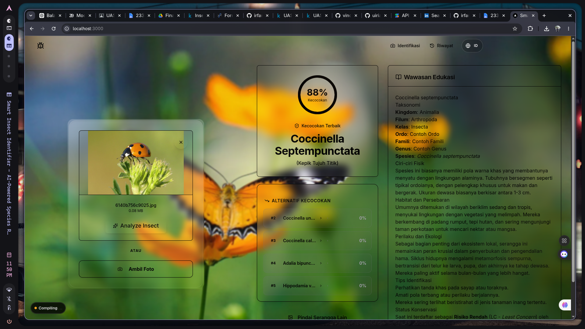
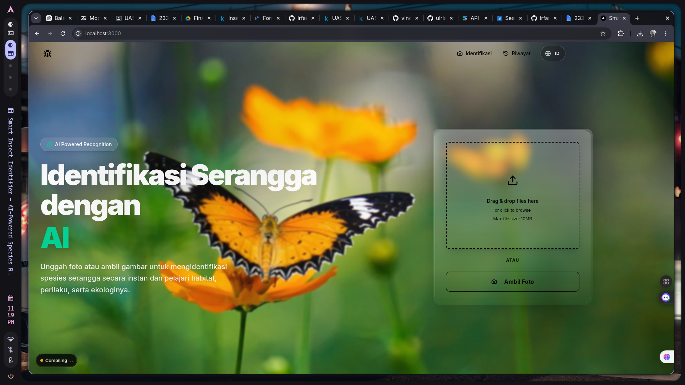

# 🦋 Smart Insect Identifier (InsectNet)

An AI-Powered Species Recognition system that identifies insect species using Machine Learning and provides rich educational insights about their characteristics, habitat, and behavior.

---

## 📑 System Summary

**Smart Insect Identifier** is a full-stack application designed to help users recognize various insect species from uploaded images. By combining a deep learning model for classification and Generative AI for generating comprehensive insights, this system not only tells you what insect it is but also educates you about it.

### ✨ Key Features
- **Accurate Identification**: Powered by PyTorch, it predicts the insect species along with confidence levels.
- **Educational Insights**: Integrates with Google Generative AI (Gemini) to provide context-rich data such as habitat, behavior, and threat levels.
- **History Tracking**: Keeps a history of user scans and prediction results.
- **Modern UI/UX**: Built with Next.js, featuring a sleek dark mode design, glassmorphism UI, and smooth micro-animations using Framer Motion.
- **Bilingual Support**: Includes local Indonesian names for various insects alongside their Latin scientific names.

---

## 📸 Screenshots

<div style="display: flex; gap: 10px;">
  
  
</div>

---

## 🛠️ Technology Stack

**Frontend**
- **Framework**: [Next.js 16](https://nextjs.org/) (App Router)
- **UI Library**: [React 19](https://react.dev/), [Shadcn UI](https://ui.shadcn.com/)
- **Styling**: [Tailwind CSS v4](https://tailwindcss.com/)
- **Animation**: [Framer Motion](https://www.framer.com/motion/)
- **Language**: TypeScript

**Backend**
- **Framework**: [FastAPI](https://fastapi.tiangolo.com/)
- **Machine Learning**: [PyTorch](https://pytorch.org/), Torchvision
- **Image Processing**: Pillow
- **AI Integration**: Google Generative AI (`google-generativeai`)
- **Language**: Python 3

---

## 🚀 How to Run Locally

### Prerequisites
- **Node.js** (v18 or newer)
- **Python** (v3.9 or newer)

### 1. Starting the Backend
The backend serves the API for image prediction and data insights.

```bash
# Navigate to the backend directory
cd backend

# Create and activate a virtual environment (optional but recommended)
python -m venv .venv
source .venv/bin/activate  # On Windows use: .venv\Scripts\activate

# Install dependencies
pip install -r requirements.txt

# Run the backend server using the provided shell script
./run.sh

# Note: The backend usually runs on http://127.0.0.1:8000
```

### 2. Starting the Frontend
The frontend is the interactive web interface for users.

```bash
# Navigate to the frontend directory
cd frontend

# Install dependencies
npm install

# Start the development server
npm run dev

# Note: The frontend will be available at http://localhost:3000
```

---

## 🔧 Environment Variables
If the project uses API keys (e.g., for Google Gemini AI or database connections), ensure you create `.env` files in both `backend` and `frontend` directories based on the provided `.env.example` templates.
